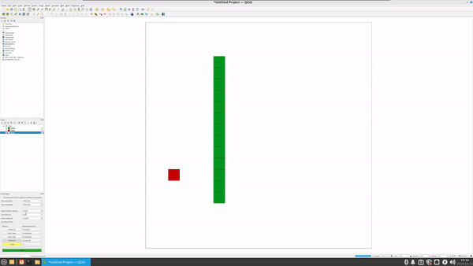
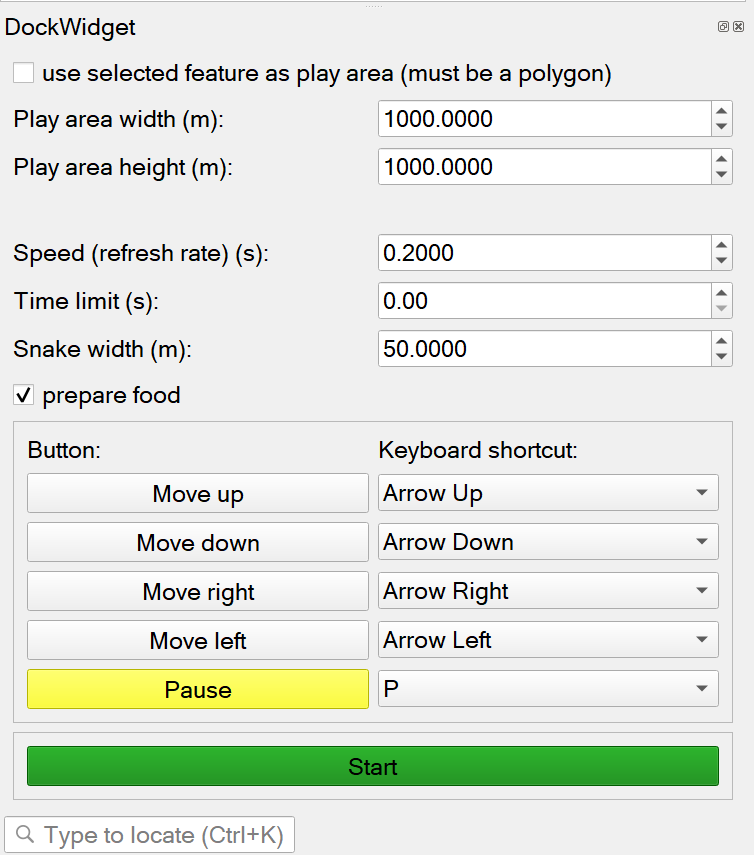
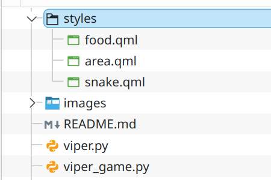

# Viper (a QGIS snake clone)

__Viper__ is a __QGIS snake clone__ made entirely from __Qgs__ objects, utilizing __QGIS__ geometry manipulation methods in order to create a working game.

It is a little project suitable for workshops teaching __GIS__ and __QGIS__ (or programming in general). 

Concepts such as __R-Tree__ (spatial index) and geometry objects and methods (points, polygons, centroids...) can be taught from it, as well as general work and programming for QGIS.

## How it works

Game creates a group at the top of the layer tree called __Viper__ in which __3__ layers are stored:
+ Snake
+ Food
+ Area

__Area__ holds a single geometry (polygon) which serves as the play area: a __rectangle__ of __width x height__ as specified in the __GUI__, or it uses a copy of a selected geometry (must be a polygon, the selected geometry is not modified in any way).

__Food__ holds a single geometry (polygon) at any time. If snake _eats_ the food, the geometry is deleted and new is created which is within the play area, but is not __contained__ within the snake.

__Snake__ holds snake parts. Each snake part is a geometry object, same size and shape as food geometry. Geometry at the first index is always its _tail_ and geometry at the last index, its _head_.
Moves every __N__ seconds, as set by the player.
  
Unless a time limit is specified, the game is finished once a snake _bites itself_ or if it exists the play area.

At any time, the game can be __paused__ and __resumed__, or it can be __stopped__ completely, by canceling the task from the bottom task manager in QGIS.

## Options

Keyboard shortcuts for actions must be set and must be __unique__. Buttons for moving and pausing the game are also clickable, but unless a very slow speed is set, it might be a bit hard to play that way.

__prepare food__ is a game optimization: instead of randomly generating a food point every time it is needed, the option instructs the game to generate and store all possible food points within the play area.
Using the option, once a snake eats the food, new food is created without a visible hiccup, but starting the game could take longer if a __HUGE__ play area is set (containing a million or more possible food locations). Also, the speed depends on the system it runs on.

__remove added layers on game end__ removes the group containing the game layers when game ends.

When a game finishes, the result is logged in the QGIS Log Messages panel.

## Layer Styling

It is possible to define styles for game layers.
Simply put your __.qml__ styles in __/styles/__ directory within the plugin directory, name them __snake.qml__, __food.qml__ and __area.qml__ to set the style for the appropriate layer.

Default values are green polygons for snake, red for food and white for the play area.

